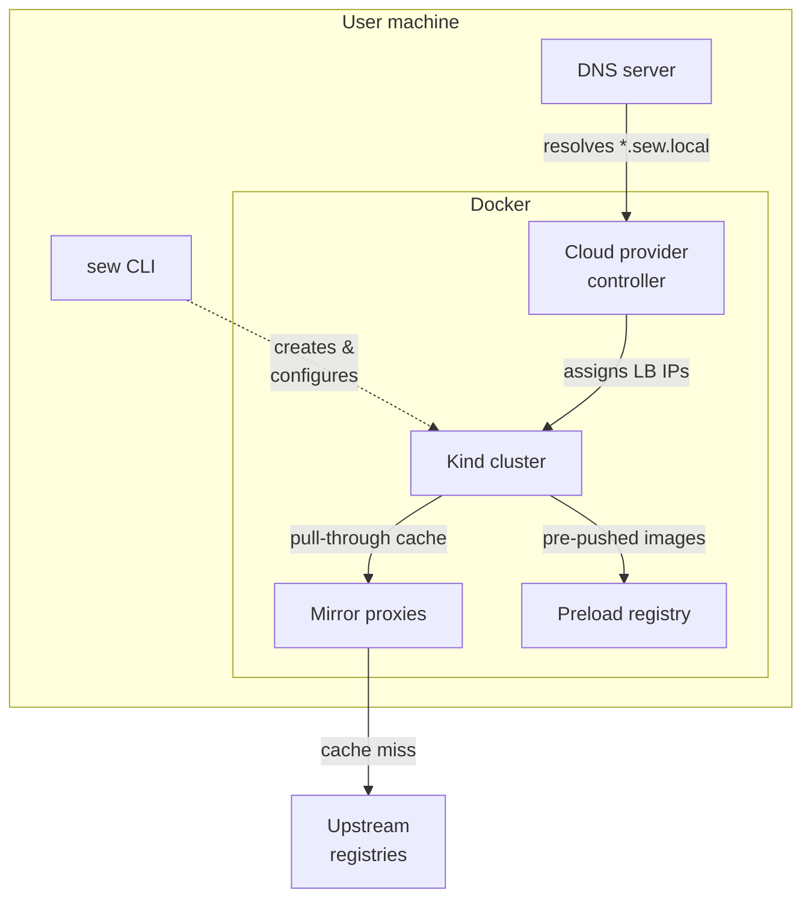
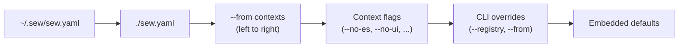
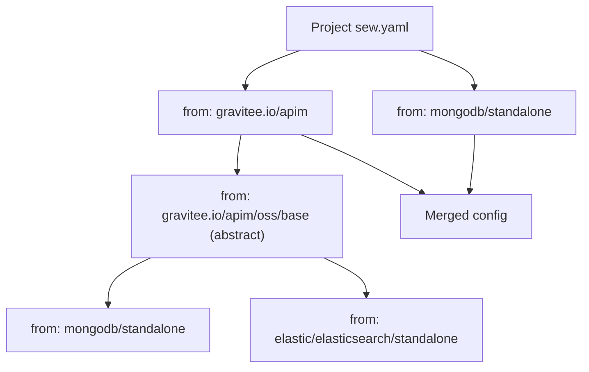

This page describes the structural architecture of sew and how its components interact.

## Component interactions

sew orchestrates several components that run as Docker containers alongside the Kind cluster. Here is how they relate to each other:

**Kind cluster** -- Kubernetes nodes running inside Docker via [Kind](https://kind.sigs.k8s.io/). sew generates the Kind config (node roles, port mappings, containerd patches) and installs Helm charts and raw manifests in dependency order.

**Mirror proxies** -- One `registry:2` container per upstream registry (docker.io, ghcr.io, etc.), configured as pull-through caches. Cached layers persist across cluster lifecycles in `~/.sew/mirrors/`.

**Preload registry** -- A `registry:2` container where sew pushes images pre-pulled on the host. Kind nodes check this registry first, before hitting mirrors or upstream. Data persists in `~/.sew/preload/`.

**Cloud provider controller** -- Provides LoadBalancer support on Kind. When Gateway API is enabled, it also manages the Envoy data-plane container.

**DNS server** -- Resolves `*.sew.local` hostnames to cluster service IPs. It discovers records from Gateway resources and static config, and hot-reloads when records are updated by `sew refresh dns`. Runs on the user machine so that the OS resolver can reach it.

## Config resolution

When sew starts, it assembles a final configuration by merging multiple layers. Each layer overrides the previous one:

The user-level base config (`~/.sew/sew.yaml`) provides personal defaults -- mirror settings, a custom registry URL, or a preferred DNS domain. The project config (`./sew.yaml` or `--config`) layers on top. Registry contexts resolved from `from` entries are merged left to right. Context flags apply last, patching components in or out.

## Context composition

When a `sew.yaml` lists multiple `from` entries, sew resolves each context from the registry and merges them into a single stack. Each registry context can itself chain further contexts via its own `from` field.

Abstract contexts (`abstract: true`) cannot be deployed directly -- they exist to capture shared configuration that concrete contexts extend. Duplicate components from overlapping `from` chains are deduplicated during merge.
